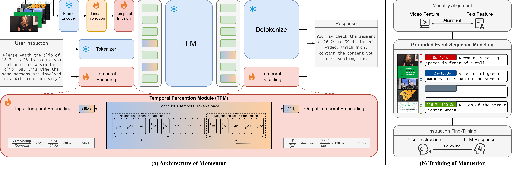

# Momentor

The official repository of paper [Momentor: Advancing Video Large Language Model with Fine-Grained Temporal Reasoning](http://arxiv.org/abs/2402.11435).

Code will be available soon.

## Momentor Overview

Momentor is a Video-LLM designed for fine-grained comprehension and localization in videos. It is composed of a frame encoder, a linear projection layer, a Temporal Perception Module (TPM), and a Large Language Model (LLM). We carefully design the Temporal Perception Module (TPM) to improve fine-grained temporal modeling and representation. Architecture and training of Momentor are shown in the following figure.




## Moment-10M

We present Moment-10M, a large-scale video instruction dataset with segment-level annotation. We use videos from YTTemporal-1B to construct Moment-10M. We propose an automatic data generation engine to extract instance and event information from these videos and generate segment-level instruction following data. We meticulously design 5 single-segment tasks and 3 cross-segment tasks, which enables Video-LLMs perform comprehensive segment-level reasoning.


We are releasing our Moment-10M dataset, you can download from the following links:
[part1](https://drive.google.com/file/d/1wLfRLmQNsq7_ckLdoAgwVFCqn-nwWdqF/view?usp=sharing), 
[part2](https://drive.google.com/file/d/1c_SN9nm6acVD47rGJh6qal117QC346fV/view?usp=sharing).


After downloading and extracting the dataset to obtain the data files, you can use [convert_data.py](scripts/convert_data.py) to transform the data into a text dialogue format and [download_videos.py](scripts/download_videos.py) to download the corresponding video files. The usage for these scripts is as follows:

```bash
python convert_data.py --source_path <path_to_data_file> --target_path <path_to_converted_file>
```
**Parameters:**

- `--source_path`: The path to the input data file that needs to be converted.
- `--target_path`: The path where the converted file will be saved. 

```bash
python download_videos.py --source_path <path_to_data_file> --video_path <path_to_store_videos>
```
**Parameters:**

- `--source_path`: The path to the input data file containing identifiers for the videos.
- `--video_path`: The path where the downloaded video files will be stored.

## Citation
If you found our work useful in your research, please consider giving this repository a star and citing our paper as followed:

```
@misc{qian2024momentor,
      title={Momentor: Advancing Video Large Language Model with Fine-Grained Temporal Reasoning}, 
      author={Long Qian and Juncheng Li and Yu Wu and Yaobo Ye and Hao Fei and Tat-Seng Chua and Yueting Zhuang and Siliang Tang},
      year={2024},
      eprint={2402.11435},
      archivePrefix={arXiv},
      primaryClass={cs.CV}
}
```

## Acknowledgment
Thanks to the open source of the following projects:
+ [LLaMA](https://github.com/facebookresearch/llama)
+ [Vicuna](https://github.com/lm-sys/FastChat)
+ [LLaVA](https://github.com/haotian-liu/LLaVA)
+ [BLIP2](https://huggingface.co/Salesforce/blip2-opt-2.7b-coco)
+ [Video-ChatGPT](https://github.com/mbzuai-oryx/Video-ChatGPT)
+ [LAVIS](https://github.com/salesforce/LAVIS)
+ [Tag2Text](https://github.com/xinyu1205/recognize-anything)
+ [GroundingDINO](https://github.com/IDEA-Research/GroundingDINO) 
+ [PySceneDetect](https://www.scenedetect.com/download)
+ [merlot_reserve](https://rowanzellers.com/merlotreserve)